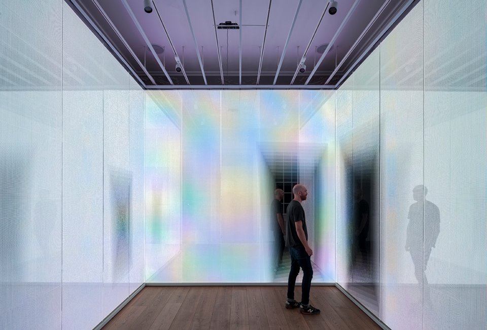
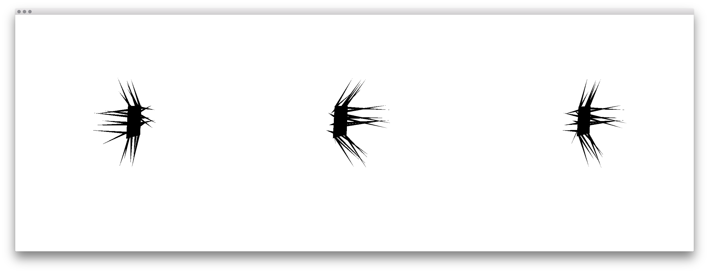
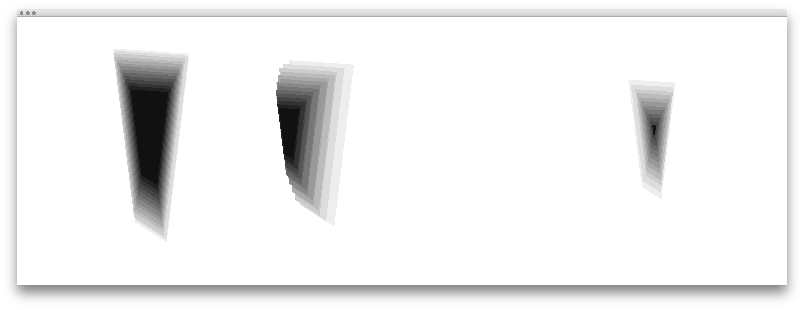
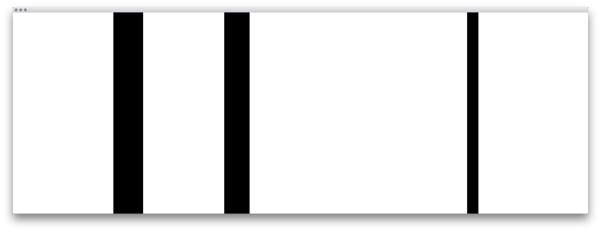

# Interactive Mirror at Galeria Melissa London

In collaboration with [Multi Randolph](http://www.mutirandolph.com/projects/5441731), develop by [Edgar](https://www.github.com/aivuk) and [me](https://www.github.com/radames)

Overhead kinect sensor and three screens.

* [OpenFrameworks](http://openframeworks.cc/)
  * [ofxCv](https://github.com/kylemcdonald/ofxCv)
  * ofxKinect
  * [ofxSyphon](https://github.com/astellato/ofxSyphon)

  

##Modes

  

  

  

